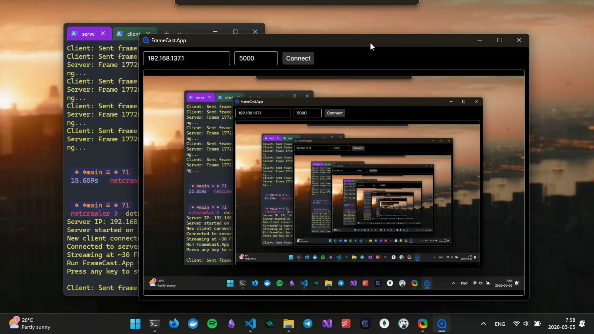

# FrameCast

**FrameCast** is a real-time LAN screen streaming system built with **.NET**.
It captures the screen, compresses frames using **JPEG**, and streams them through a **local TCP server** to clients connected on the same network.

FrameCast works in a similar spirit to remote desktop tools like AnyDesk and TeamViewer, but it is focused purely on screen streaming over a local network rather than full remote control.

---

### 🎥 Project Demo

[](https://drive.google.com/file/d/181sxsoU_G2I4HV1LTrao4V1R1VJ76_vL/view?usp=sharing)

> [!TIP]
> **Click the image above** to watch the full demo video

---

## Features

- Real-time screen capture
- JPEG frame compression
- TCP-based streaming
- Local network (LAN) support
- Multiple client connections
- desktop viewer

---

## Architecture

```text
FrameCast
│
├── FrameCast.App               # Desktop viewer (UI client)
├── FrameCast.Capture.Windows   # Windows screen capture
├── FrameCast.Core              # Shared core abstractions
├── FrameCast.Encoding          # JPEG frame compression
├── FrameCast.Protocol          # Frame message structure
├── FrameCast.Transport         # TCP networking layer
└── FrameCast.Server            # Streaming server
```

---

## How It Works

1. The server captures the screen.
2. Frames are compressed into JPEG.
3. Frames are sent over TCP.
4. The server broadcasts frames to connected clients.
5. Clients receive and render the stream.

---

## Running the Project

### Start the Streaming Server

```bash
dotnet run src/FrameCast.Server
```

### Start the Viewer

```bash
dotnet run src/FrameCast.App
```

Connect using the **server machine's LAN IP**.

Example:

```
Server IP: 192.168.1.6
Port: 5000
```

Both machines must be connected to the **same local network**.

---

## License

This project is licensed under the MIT License - see the [LICENSE](LICENSE) file for details.